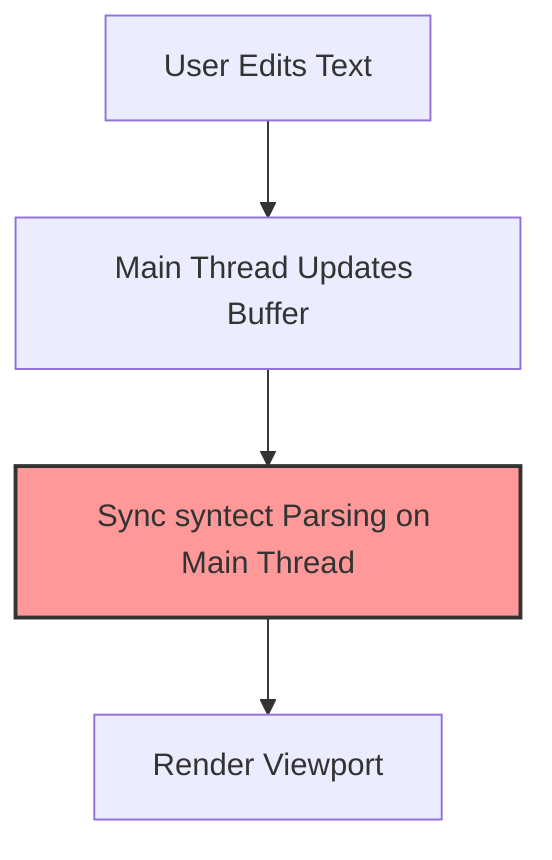
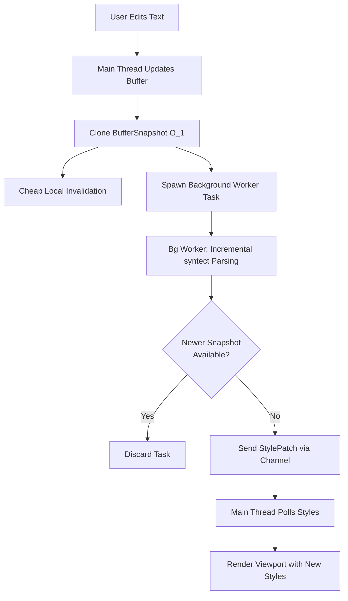
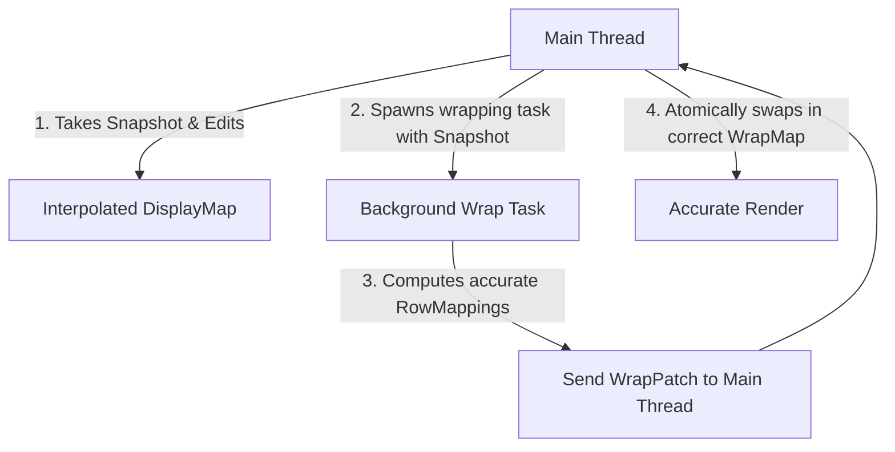

# Asynchronous Text Processing in DZED

High-performance text editors must remain highly responsive. Blocking the main thread—even for a few milliseconds—results in frame drops, cursor lag, and a degraded user experience. 

In DZED, two of the most computationally expensive operations on the UI thread are:
1. **Syntax Highlighting**: Tokenizing and parsing code using the stateful `syntect` engine.
2. **Soft-Wrapping (`WrapMap` / `DisplayMap`)**: Calculating line-wrap boundaries, which requires resolving character offsets and measuring font metrics.

This document analyzes and provides a detailed blueprint for moving both **Highlighting** and **Soft-Wrapping** to background threads, leveraging the core persistent data structures of the editor—most notably `BufferSnapshot`.

---

## 1. The Core Secret: `BufferSnapshot`

Both asynchronous pipelines depend fundamentally on `BufferSnapshot` (provided by the `text` crate).

### What is `BufferSnapshot`?
`BufferSnapshot` is an immutable, read-only representation of the text buffer at a specific point in time. It is implemented using a copy-on-write B-Tree (`sum_tree::SumTree` under the hood in upstream Zed).

### Why is it perfect for Async?
* **$O(1)$ Cheap Cloning**: Cloning a `BufferSnapshot` does not duplicate the underlying text in memory; it simply increments reference counts on the tree nodes.
* **Lock-Free Sharing**: Because it is immutable, a `BufferSnapshot` can be safely sent (`Send + Sync`) to background thread pools (e.g., Tokio or Rayon) without requiring locks (`Mutex`/`RwLock`) or risking data races with the main thread.
* **Consistent View**: The background worker can process a snapshot indefinitely, confident that the text will not change underneath it while the user continues typing on the main thread.

---

## 2. Asynchronous Syntax Highlighting

Currently, DZED highlights lines synchronously in the main rendering loop when `dirty_hl` is set, blocking the UI thread on heavy tokenization.



### Proposed Asynchronous Architecture

To make highlighting asynchronous, we decouple editing from tokenization using background workers and a state/style cache.



### Highlighting Worker Lifecycle

1. **On Buffer Edit**:
   * The main thread computes the cheap `BufferSnapshot`.
   * It performs a cheap local invalidation on its thread-safe `Highlights` manager:
     ```rust
     active_buffer.hl.invalidate_state(start_row);
     ```
   * It increments an atomic `current_version: Arc<AtomicU64>` counter on the buffer.
   * It spawns/dispatches a background task.

2. **Background Task Processing**:
   * The task accepts the cloned `BufferSnapshot`, a copy of the theme, the nearest cached parsing state before the edit point, and the `current_version` token.
   * It runs the syntect `HighlightLines` state machine line-by-line starting from the known parsing state.
   * **Incremental Yielding**: Every $N$ rows (e.g., 200 lines), it checks if a newer version of the buffer snapshot has been dispatched:
     ```rust
     if current_version.load(Ordering::Relaxed) > task_version {
         return; // Abort early; task is obsolete
     }
     ```
   * It populates a new `StyleCache` and `StateCache` for the processed segment.

3. **Publishing & Integration**:
   * Upon completing the viewport or the entire document, the task packages the results in a `HighlightPatch`:
     ```rust
     struct HighlightPatch {
         start_row: u32,
         end_row: u32,
         style_cache: HashMap<u32, StyleCache>,
         state_cache: HashMap<usize, StateCache>,
         snapshot_id: u64,
     }
     ```
   * It sends this `HighlightPatch` over a lock-free channel (e.g., `crossbeam_channel`).
   * On the next frame, the main thread reads the channel, incorporates the style caches, and schedules a redraw.

---

## 3. Asynchronous Soft-Wrapping

Soft-wrapping calculates display-line boundaries based on screen width. Because wrapping requires measuring character shapes and column widths, it is heavily bound by font rendering/character-width calculations.

### Proposed Asynchronous Architecture



### The Secret: Interpolation & Approximation

If we waited for background wrapping to finish, the cursor would feel disconnected from typing (typing characters would take a fraction of a second to wrap). To prevent this, we use **Interpolated Wrapping**:

1. **Instant Approximation (Main Thread)**:
   * When the user types on line $L$, the main thread immediately applies a quick heuristic wrap to line $L$ in its local `DisplayMap` (e.g., character-count approximation) so typing feels instantaneous.
   * Coordinates and offsets are instantly updated so the cursor moves immediately.

2. **Accurate Calculation (Background Worker)**:
   * A background task is kicked off with the exact `BufferSnapshot` and font-measurement parameters.
   * The worker runs the true wrapping algorithm, generating a precise `WrapSnapshot` (e.g., using a `SumTree<Transform>` to track wrapped rows efficiently).
   * It pushes the completed `WrapSnapshot` to the main thread.

3. **Atomic Swap**:
   * The main thread swaps in the accurate `WrapSnapshot`, replacing the approximated one seamlessly.

---

## 4. Implementation Blueprint (Rust)

Below is a mock blueprint of how to integrate this model using Tokio (or another thread pool pool) and a channel-based event-loop receiver.

### Highlighting and Wrapping Messages

```rust
pub enum BackgroundResult {
    HighlightComplete {
        file_path: String,
        style_cache: HashMap<u32, StyleCache>,
        state_cache: HashMap<usize, StateCache>,
        version: u64,
    },
    WrapComplete {
        file_path: String,
        row_mappings: Arc<Vec<RowMapping>>,
        version: u64,
    },
}
```

### Background Worker Dispatcher

```rust
use std::sync::atomic::{AtomicU64, Ordering};
use std::sync::Arc;
use crossbeam_channel::Sender;

pub struct AsyncWorkerPool {
    tx: Sender<BackgroundResult>,
    current_version: Arc<AtomicU64>,
}

impl AsyncWorkerPool {
    pub fn dispatch_highlight(
        &self,
        file_path: String,
        snapshot: BufferSnapshot,
        start_row: u32,
        theme: Theme,
    ) {
        let tx = self.tx.clone();
        let version = self.current_version.fetch_add(1, Ordering::SeqCst) + 1;
        let atomic_version = self.current_version.clone();

        tokio::task::spawn_blocking(move || {
            let mut highlighter = HighlightLines::new(&syntax, &theme);
            let mut local_style_cache = HashMap::new();
            let mut local_state_cache = HashMap::new();
            
            let row_count = snapshot.row_count();
            for row in start_row..row_count {
                // Cooperative cancellation check
                if atomic_version.load(Ordering::Relaxed) > version {
                    return; // Obsolete buffer edit occurred; abort task
                }

                let text = snapshot.row_text(row) + "\n";
                if let Ok(ranges) = highlighter.highlight_line(&text, &syntax_set) {
                    let mut styles = Vec::new();
                    let mut col = 0;
                    for (style, text) in ranges {
                        let start = col;
                        col += text.chars().count() as u32;
                        styles.push((style, start, col));
                    }
                    local_style_cache.insert(row, StyleCache { styles });
                }
                
                // Cache intermediate states periodically
                if row % 80 == 0 {
                    let (hs, ps) = highlighter.state();
                    local_state_cache.insert(row as usize, StateCache {
                        line_number: row,
                        highlight_state: hs.clone(),
                        parser_state: ps.clone(),
                    });
                }
            }

            let _ = tx.send(BackgroundResult::HighlightComplete {
                file_path,
                style_cache: local_style_cache,
                state_cache: local_state_cache,
                version,
            });
        });
    }
}
```

### Main Thread Integration (The Event Loop)

In `main.rs`, on each frame, we drain the incoming background results and apply them directly to our `BufferManager`:

```rust
// In the rendering / input polling loop:
while let Ok(result) = rx.try_recv() {
    match result {
        BackgroundResult::HighlightComplete { file_path, style_cache, state_cache, version } => {
            if let Some(buf) = editor.buffer_manager.find_by_path_mut(&file_path) {
                // Only apply if the results correspond to the latest version of the edited buffer
                if version >= buf.hl_version {
                    buf.hl_version = version;
                    buf.hl.merge_caches(style_cache, state_cache);
                    should_redraw = true;
                }
            }
        }
        BackgroundResult::WrapComplete { file_path, row_mappings, version } => {
            if let Some(buf) = editor.buffer_manager.find_by_path_mut(&file_path) {
                if version >= buf.wrap_version {
                    buf.wrap_version = version;
                    buf.display_map.apply_wrap_mappings(row_mappings);
                    should_redraw = true;
                    should_sync = true;
                }
            }
        }
    }
}
```

---

## 5. Key Tradeoffs & Challenges

1. **Memory Consumption**:
   Background processing requires carrying multiple `BufferSnapshot` instances in memory simultaneously. Thanks to copy-on-write sharing, this overhead is minimal unless the document is modified extensively across very distant ranges.

2. **Incremental Highlighting vs Full-rebuild**:
   Parsing state must theoretically run from row 0 to guarantee accuracy (due to things like unclosed multiline strings or HTML blocks). To keep this efficient asynchronously, the background thread starts parsing from the nearest known stable `StateCache` row prior to the edit, minimizing unnecessary redundant scanning.

3. **Grapheme Boundaries and Layout**:
   Wrapping accurately depends on actual font dimensions. If text wrapping shifts mid-way because the background task finished, layout adjustments might slide slightly on-screen. This is solved by syncing rendering offsets immediately during interpolation, so the actual swap of wrapping mappings occurs with zero visual displacement.
