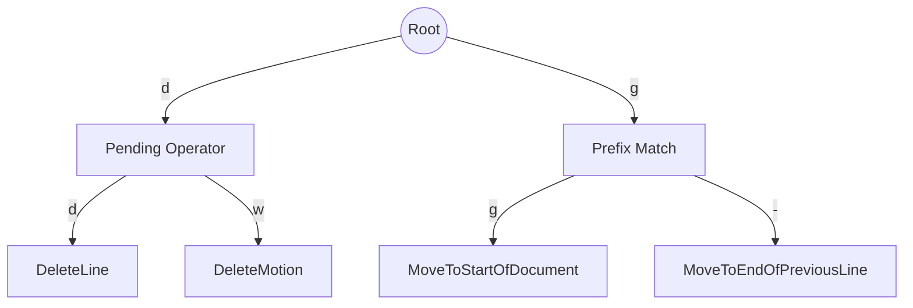

# Keymap & Action Resolution Speed Improvements

This document outlines structural and algorithmic optimizations for the keymap and input state machine in `dzd`.

---

## 1. Algorithmic Optimization: Prefix Tree (Trie) Keymaps

### Current Approach
Currently, key bindings are stored in flat hash maps:
```rust
pub struct Keymap {
    pub op_actions: HashMap<KeyComboSequence, Action>,
    pub motion_actions: HashMap<KeyComboSequence, Action>,
    // ...
}
```
During matching, `match_sequence_in_map` performs a linear scan over all registered bindings (`for (seq, action) in map`) to check if the current input buffer matches each pattern. 
- **Complexity**: $O(N)$ where $N$ is the number of registered bindings.
- **Problem**: For large keymaps (hundreds of Vim bindings, custom user maps), iterating through all entries on every key press becomes increasingly expensive.

### Proposed Improvement: Trie-based Resolution
A **Trie (Prefix Tree)** is the standard and most efficient data structure for representing prefix sequences. Each node represents a `KeyCombo`, containing an optional `Action` (if a sequence ends there) and a map of transition edges to child nodes.



- **Complexity**: $O(L)$ where $L$ is the length of the input key sequence (typically $1 \le L \le 3$). This is completely independent of the number of registered bindings $N$.
- **Benefits**:
  - **Instant Failures**: If a key sequence has no possible match, the lookup fails immediately at the root or near the top, avoiding unnecessary checks.
  - **Deterministic Resolution**: The trie structure naturally represents complete matches and prefix matches without needing complex loops and backtracking.

---

## 2. Memory & Allocation Optimizations

### Current Bottleneck
During sequence matching:
- A combined sequence vector is allocated and populated via `.clone()` and `.extend()`:
  ```rust
  let mut combined = self.pending_op_sequence.clone();
  combined.extend(self.key_sequence.clone());
  ```
- Count buffers are parsed from strings, and single keys are parsed using character allocations.

### Proposed Improvements
1. **Use Stack-Allocated Sequences (`SmallVec` or Array)**:
   Since Vim key sequences are rarely longer than 4 or 5 keys, we can replace heap-allocated `Vec<KeyCombo>` with stack-allocated arrays or `smallvec::SmallVec<[KeyCombo; 8]>`. This completely eliminates heap allocations during keypress processing.
2. **Slice-based Lookup**:
   Lookup functions should operate on slices `&[KeyCombo]` instead of cloning or creating combined vectors.

---

## 3. Fast-Path / Reject Caching

- **Fast Reject**: Keep a quick boolean mask or lookup of valid starting keys. If a key is pressed that is not a starting character of any sequence, operator, or motion, immediately treat it as a `NoOp` or discard it without triggering any map lookups.
- **Inline KeyCombos**: Make `KeyCombo` a simple `u32` or `u64` bitfield representing the `KeyCode` and `KeyModifiers` internally. Comparing integers is significantly faster than checking enums and structured types.

---

## 4. Vim Limitations under Current Architecture

The current architecture of `dzd`'s input state machine and action resolution presents constraints that make supporting certain advanced Vim features difficult or impossible without a redesign:

### A. Named Registers (`"ayw`, `"bp`)
- **Limitation**: Currently, `InputStateMachine` only tracks integer counts (`count_buffer`) and key sequences. It does not support parsing register identifiers (`"a`, `"b`, `"+`, etc.).
- **Impact**: Multi-clipboard operations, yank/paste registers, and clipboard synchronization cannot be bound via the standard keymap.
- **Redesign Needed**: The state machine would need to introduce a `register_buffer` and intermediate `PendingRegister` states.

### B. Recursive vs Non-Recursive Custom Key Mappings (`map` vs `noremap`)
- **Limitation**: `Keymap` maps sequences directly to static `Action` variants. There is no concept of mapping a sequence of keys to another sequence of keys (e.g. `nmap; :`).
- **Impact**: Custom key remaps that rely on evaluating sequence transitions recursively are unsupported.
- **Redesign Needed**: Introducing a mapping translation layer before the state machine evaluates the sequence.

### C. Macros (`qa`, `q`, `@a`)
- **Limitation**: Input events are processed transiently; there is no recording buffer or mechanism to replay keys/actions.
- **Impact**: Macro recording, playback, and macro nesting are unsupported.
- **Redesign Needed**: An event-hook or action-recording middleware that intercepts keystrokes before they are cleared by `InputStateMachine`.

### D. Advanced Text Objects (`aw`, `iw`, `a"`, `i(`, `it`)
- **Limitation**: Currently, operators depend on motions (`motion_actions`). Vim's "text objects" (like `inner word`, `around tag`) are treated as semantic objects rather than raw directional motions.
- **Impact**: You cannot easily delete "inside quotes" (`di"`) or change "around parentheses" (`ca(`) using directional motion matching.
- **Redesign Needed**: Separating `motion_actions` from a new `text_object_actions` map, allowing operators to accept text objects as targets instead of just motions.

### E. Ex Command-Line Range Commands (`:10,20d`, `:%s/foo/bar/g`)
- **Limitation**: Transitioning to `:` sets the mode to `Mode::Command` and routes input characters directly to a text buffer, but there is no command parser or interpreter (no AST evaluation).
  - **Impact**: Complex Vim ranges, substitutions, and buffer commands are not executable.
  - **Redesign Needed**: A regex/ex command parser and engine that operates on the document structure.

---

## 5. Comprehensive Vim Keybindings Checklist

Below is a checklist of standard Vim keybindings categorised by function, showing their implementation status in `dzd`.

### Mode Transitions
| Binding | Action | Status |
|---|---|---|
| `i` | Enter Insert mode (before cursor) | [x] Implemented |
| `I` | Enter Insert mode (at start of line) | [x] Implemented |
| `a` | Enter Insert mode (after cursor) | [x] Implemented |
| `A` | Enter Insert mode (at end of line) | [x] Implemented |
| `o` | Open new line below and enter Insert mode | [x] Implemented |
| `O` | Open new line above and enter Insert mode | [x] Implemented |
| `v` | Enter character-wise Visual mode | [x] Implemented |
| `V` | Enter line-wise Visual mode | [x] Implemented |
| `C-v` | Enter block-wise Visual mode | [x] Implemented |
| `:` | Enter Command-line mode | [x] Implemented |
| `Esc` | Return to Normal mode / Clear selections | [x] Implemented |

### Basic Navigation & Motions
| Binding | Motion | Status |
|---|---|---|
| `h` / `Left` | Move cursor left | [x] Implemented |
| `l` / `Right` | Move cursor right | [x] Implemented |
| `k` / `Up` | Move cursor up | [x] Implemented |
| `j` / `Down` | Move cursor down | [x] Implemented |
| `0` / `Home` | Move to start of line | [x] Implemented |
| `^` | Move to first non-space character of line | [x] Implemented |
| `$` / `End` | Move to end of line | [x] Implemented |
| `+` | Move to start of next line | [x] Implemented |
| `-` | Move to start of previous line | [x] Implemented (Via binding) |
| `gg` | Move to start of document | [x] Implemented |
| `G` | Move to end of document | [x] Implemented |
| `H` | Move to top of screen | [ ] Unimplemented |
| `M` | Move to middle of screen | [ ] Unimplemented |
| `L` | Move to bottom of screen | [ ] Unimplemented |
| `\|` | Move to specific column | [ ] Unimplemented |

### Word Navigation
| Binding | Motion | Status |
|---|---|---|
| `w` | Move forward to start of next word | [x] Implemented |
| `W` | Move forward to start of next big word | [x] Implemented |
| `e` | Move forward to end of next word | [x] Implemented |
| `E` | Move forward to end of next big word | [x] Implemented |
| `b` | Move backward to start of previous word | [x] Implemented |
| `B` | Move backward to start of previous big word | [x] Implemented |
| `ge` | Move backward to end of previous word | [x] Implemented |
| `gE` | Move backward to end of previous big word | [x] Implemented |

### Paragraph & Sentence Navigation
| Binding | Motion | Status |
|---|---|---|
| `{` | Move to previous paragraph | [x] Implemented |
| `}` | Move to next paragraph | [x] Implemented |
| `(` | Move to previous sentence | [ ] Unimplemented |
| `)` | Move to next sentence | [ ] Unimplemented |

### Character Search
| Binding | Motion | Status |
|---|---|---|
| `f{char}` | Move to next occurrence of `{char}` | [x] Implemented |
| `F{char}` | Move to previous occurrence of `{char}` | [x] Implemented |
| `t{char}` | Move up to next occurrence of `{char}` | [x] Implemented |
| `T{char}` | Move up to previous occurrence of `{char}` | [x] Implemented |
| `;` | Repeat last character search | [ ] Unimplemented |
| `,` | Repeat last character search (reversed) | [ ] Unimplemented |

### Scrolling
| Binding | Scroll Action | Status |
|---|---|---|
| `C-f` / `PgDn` | Scroll forward one full screen | [x] Implemented |
| `C-b` / `PgUp` | Scroll backward one full screen | [x] Implemented |
| `C-d` | Scroll down half screen | [x] Implemented |
| `C-u` | Scroll up half screen | [x] Implemented |
| `C-e` | Scroll screen down one line | [x] Implemented |
| `C-y` | Scroll screen up one line | [x] Implemented |

### Operators (Pending Motions)
| Binding | Action | Status |
|---|---|---|
| `d` | Delete motion | [x] Implemented |
| `c` | Change motion | [x] Implemented |
| `y` | Yank motion | [x] Implemented |
| `>` | Indent motion | [ ] Unimplemented |
| `<` | Outdent motion | [ ] Unimplemented |
| `g~` | Swap case motion | [ ] Unimplemented |

### Editing Actions (Normal Mode)
| Binding | Action | Status |
|---|---|---|
| `dd` | Delete current line | [x] Implemented |
| `cc` | Change current line | [x] Implemented |
| `yy` | Yank current line | [x] Implemented |
| `x` / `Delete` | Delete character under cursor | [x] Implemented |
| `X` / `Backspace` | Delete character before cursor | [x] Implemented |
| `p` | Paste clipboard content after cursor | [x] Implemented |
| `P` | Paste clipboard content before cursor | [x] Implemented |
| `J` | Join current and next line | [x] Implemented |
| `u` | Undo | [x] Implemented |
| `C-r` | Redo | [x] Implemented |
| `.` | Repeat last change | [ ] Unimplemented |
| `>>` | Indent current line | [ ] Unimplemented |
| `<<` | Outdent current line | [ ] Unimplemented |
| `~` | Swap case of current character | [ ] Unimplemented |
| `r{char}` | Replace character under cursor with `{char}` | [ ] Unimplemented |
| `R` | Enter Replace mode | [ ] Unimplemented |

### Search
| Binding | Search Action | Status |
|---|---|---|
| `/` | Search forward | [x] Implemented |
| `?` | Search backward | [x] Implemented |
| `n` | Repeat search forward | [x] Implemented |
| `N` | Repeat search backward | [x] Implemented |
| `*` | Search forward for word under cursor | [ ] Unimplemented |
| `#` | Search backward for word under cursor | [ ] Unimplemented |
